# AgriAI

**Smart Farming Solutions Powered by Artificial Intelligence**

AgriAI is a comprehensive farm management platform that uses ai to help farmers optimize their operations, increase yields, and make data-driven decisions. Built with Laravel 12, Livewire 3, and Tailwind CSS 4.

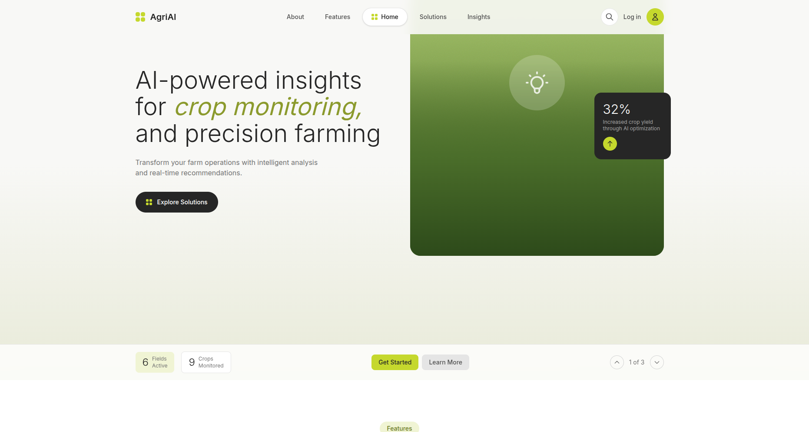

---

## Table of Contents

- [Features](#features)
- [Screenshots](#screenshots)
- [Tech Stack](#tech-stack)
- [Requirements](#requirements)
- [Installation](#installation)
- [Configuration](#configuration)
- [Usage](#usage)
- [API Integrations](#api-integrations)
- [Project Structure](#project-structure)
- [Testing](#testing)
- [Contributing](#contributing)
- [License](#license)

---

## Features

### Farm Management
- Create and manage multiple farms with detailed information
- Track farm locations with automatic GPS coordinate detection
- Monitor farm size, soil types, and crop suitability
- View farm-specific analytics and performance metrics

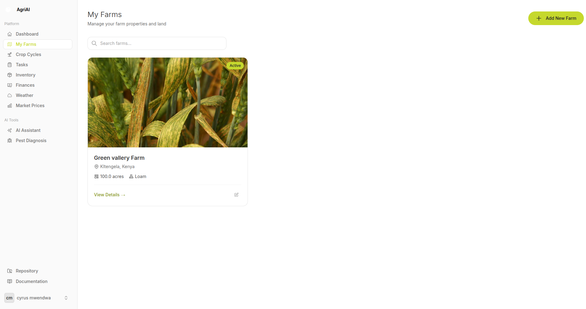

### Crop Cycle Tracking
- Plan and monitor crop cycles from planting to harvest
- Track growth stages with progress indicators
- Calculate expected yields and harvest dates
- Manage multiple crops across different fields

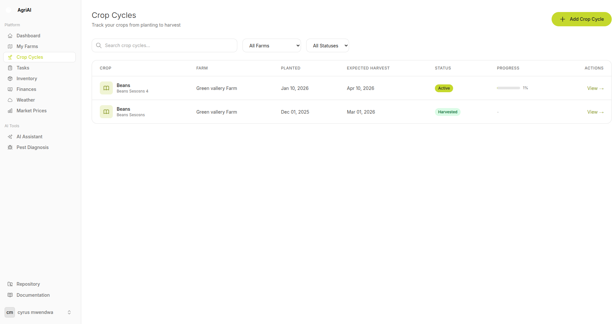

### Task Management
- Create and assign farming tasks with priorities
- Set due dates and track completion status
- Filter tasks by status, priority, and farm
- Visual task board with quick status updates

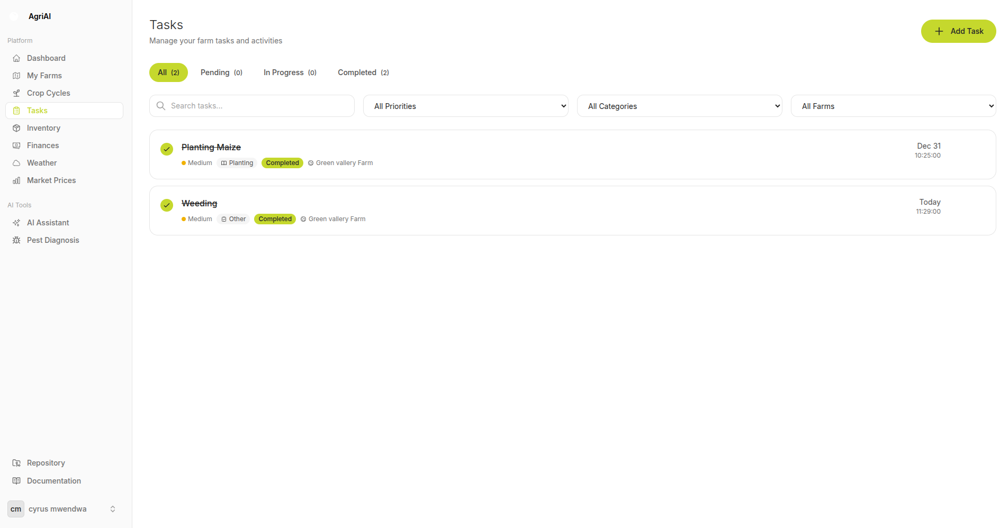

### Inventory Management
- Track seeds, fertilizers, equipment, and supplies
- Monitor stock levels with low-stock alerts
- Record inventory transactions (additions, removals, adjustments)
- Categorize items for easy organization

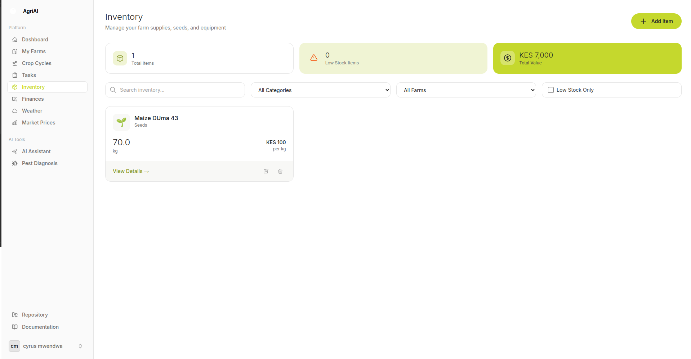

### Financial Tracking
- Record farm expenses and income
- Categorize transactions for better insights
- View financial summaries and profit/loss reports
- Generate expense reports by category and date range

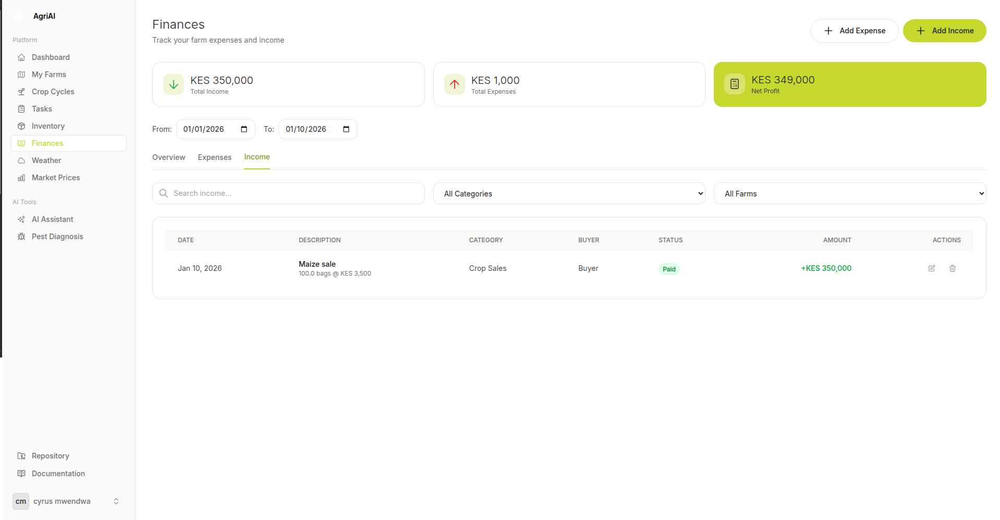

### AI Assistant
- Get personalized farming advice powered by AI
- Ask questions about crops, pests, soil, and weather
- Receive context-aware recommendations based on your farm data
- Conversation history for reference

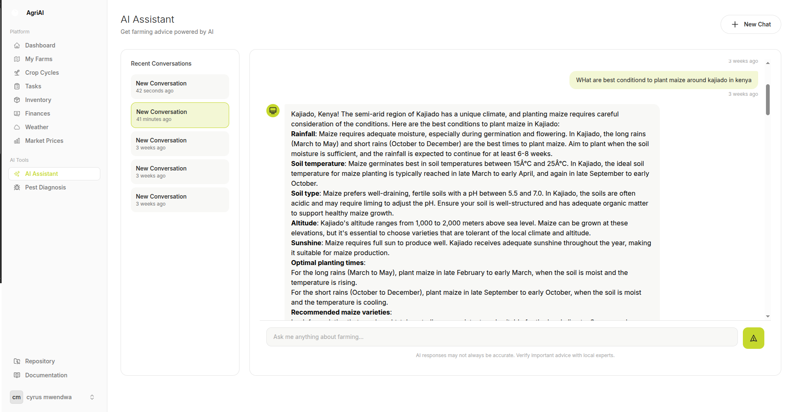

### AI Pest Diagnosis
- Upload plant images for instant pest/disease detection
- Get detailed diagnosis with treatment recommendations
- Powered by Google Gemini Vision API
- Save diagnosis history for tracking

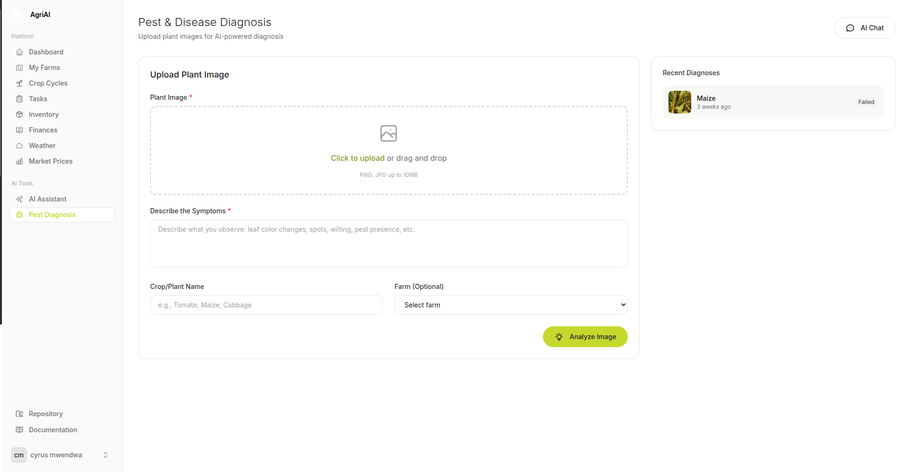

### Weather Forecasting
- Real-time weather data for your farm locations
- 5-day weather forecasts with detailed conditions
- Temperature, humidity, wind speed, and precipitation data
- Weather-based farming recommendations

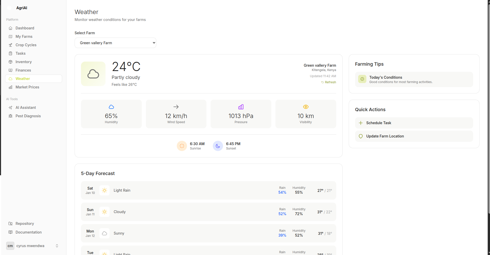

### Market Prices
- Track agricultural commodity prices
- View price trends and historical data
- Get market insights for better selling decisions
- Support for local and regional markets

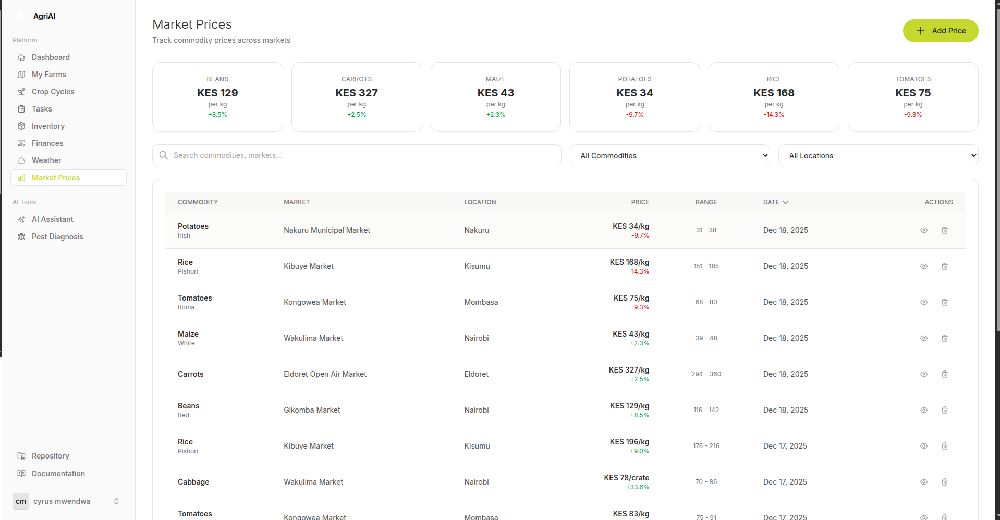

### Responsive Dashboard
- Comprehensive overview of all farm operations
- Quick stats and key performance indicators
- Recent activity feed
- Mobile-friendly design

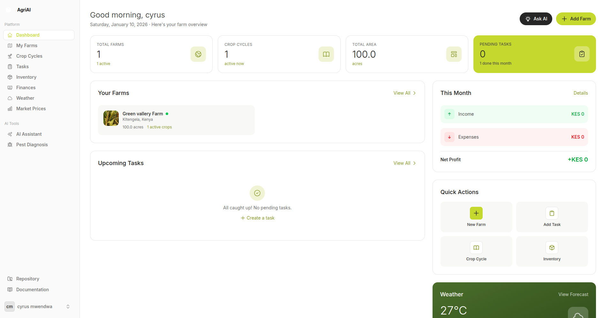

---

## Screenshots

### Landing Page


### Authentication

| Login | Register |
|-------|----------|
| 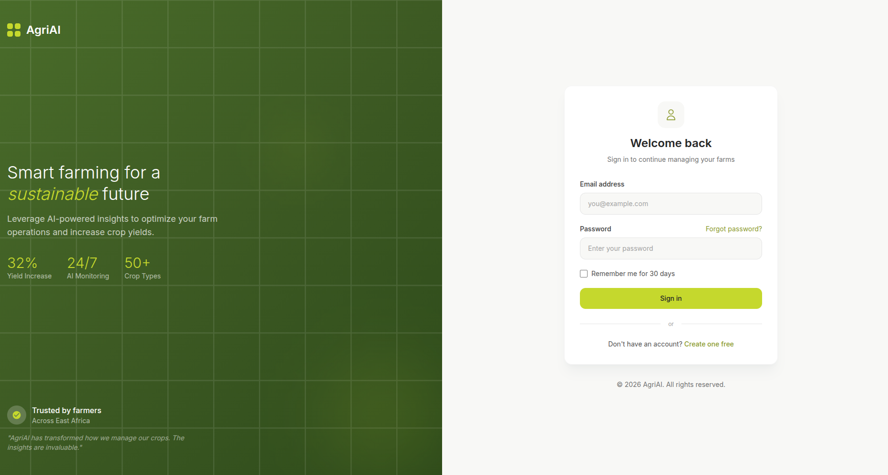 | 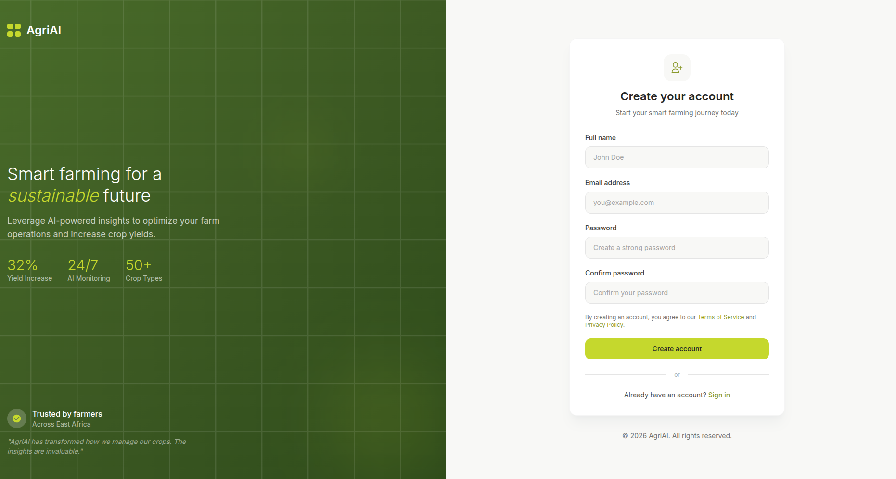 |

### Dashboard


### Farm Details
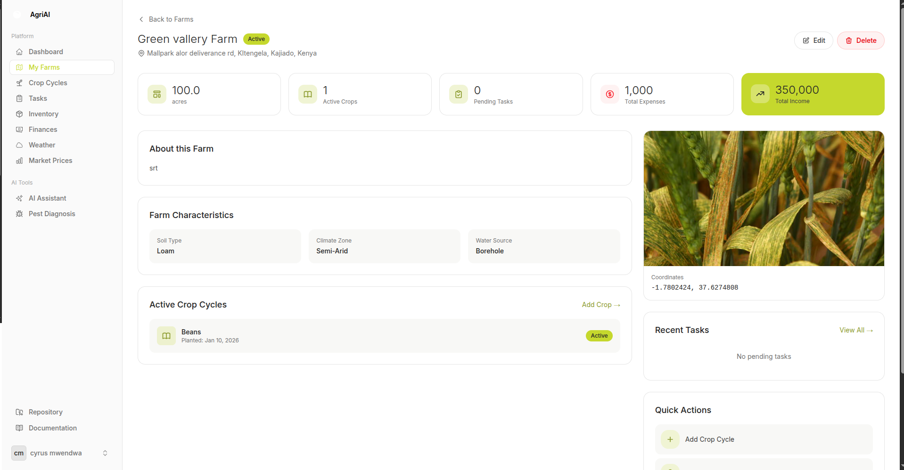

### Crop Cycle Details
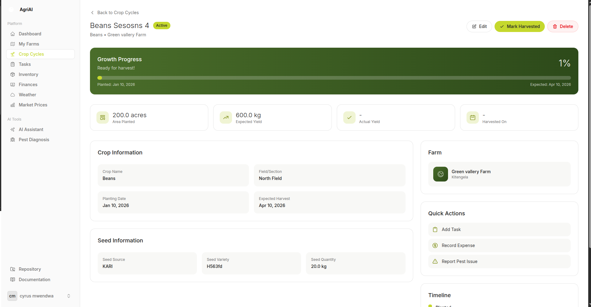

### AI Features

| AI Chat Assistant | Pest Diagnosis |
|-------------------|----------------|
|  |  |

### Two-Factor Authentication
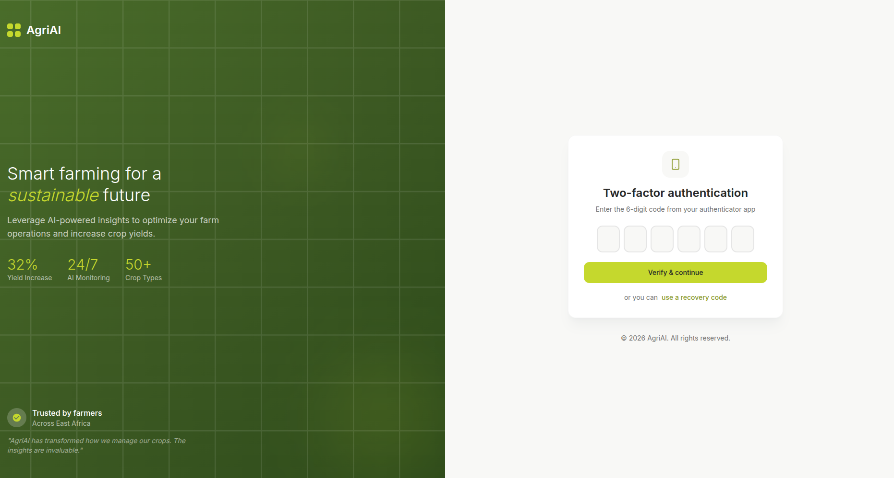

---

## Tech Stack

### Backend
- **PHP 8.3** - Modern PHP with type declarations and attributes
- **Laravel 12** - Latest Laravel framework with streamlined structure
- **Laravel Fortify** - Authentication scaffolding with 2FA support
- **MySQL/SQLite** - Database options for development and production

### Frontend
- **Livewire 3** - Full-stack framework for dynamic interfaces
- **Flux UI** - Beautiful component library for Livewire
- **Tailwind CSS 4** - Utility-first CSS framework
- **Alpine.js** - Lightweight JavaScript framework (bundled with Livewire)

### AI and External Services
- **Groq API** - Fast LLM for chat functionality (Llama 3.3 70B)
- **Google Gemini API** - Vision model for pest diagnosis
- **Open-Meteo API** - Weather data and forecasts

### Development Tools
- **Laravel Pint** - PHP code style fixer
- **Pest PHP 4** - Modern testing framework
- **Laravel Sail** - Docker development environment
- **Vite** - Frontend build tool

---

## Requirements

- PHP >= 8.2
- Composer >= 2.0
- Node.js >= 18.0
- npm >= 9.0
- MySQL 8.0+ or SQLite
- Git

---

## Installation

### 1. Clone the Repository

```bash
git clone https://github.com/TechGriffo254/AgriAI.git
cd agriAI
```

### 2. Install Dependencies

```bash
# Install PHP dependencies
composer install

# Install Node.js dependencies
npm install
```

### 3. Environment Setup

```bash
# Copy environment file
cp .env.example .env

# Generate application key
php artisan key:generate
```

### 4. Database Setup

```bash
# Run migrations
php artisan migrate

# (Optional) Seed with sample data
php artisan db:seed
```

### 5. Build Assets

```bash
# For development
npm run dev

# For production
npm run build
```

### 6. Start the Application

```bash
# Using Laravel's built-in server
php artisan serve

# Or using the dev script (recommended)
composer run dev
```

Visit `http://localhost:8000` to access the application.

---

## Configuration

### Environment Variables

Create a `.env` file with the following configurations:

```env
# Application
APP_NAME=AgriAI
APP_ENV=local
APP_DEBUG=true
APP_URL=http://localhost:8000

# Database
DB_CONNECTION=mysql
DB_HOST=127.0.0.1
DB_PORT=3306
DB_DATABASE=agriai
DB_USERNAME=root
DB_PASSWORD=

# AI Providers
LLM_PROVIDER=groq
LLM_CHAT_PROVIDER=groq
LLM_VISION_PROVIDER=gemini

# Groq API (Free - for chat)
GROQ_API_KEY=your_groq_api_key

# Google Gemini API (for vision/pest diagnosis)
GEMINI_API_KEY=your_gemini_api_key

# Queue (for background jobs)
QUEUE_CONNECTION=database
```

### API Keys Setup

1. **Groq API** (Free)
   - Sign up at [console.groq.com](https://console.groq.com)
   - Create an API key
   - Add to `.env` as `GROQ_API_KEY`

2. **Google Gemini API**
   - Visit [ai.google.dev](https://ai.google.dev)
   - Create a project and enable the Gemini API
   - Generate an API key
   - Add to `.env` as `GEMINI_API_KEY`

---

## Usage

### Getting Started

1. **Register an Account**
   - Visit the landing page and click "Get Started"
   - Fill in your details and create an account
   - Verify your email (if enabled)

2. **Create Your First Farm**
   - Navigate to Farms > Create Farm
   - Enter farm details (name, location, size)
   - Allow location access for automatic coordinates

3. **Add Crop Cycles**
   - Go to Crop Cycles > Create
   - Select your farm and crop type
   - Set planting and expected harvest dates

4. **Use AI Assistant**
   - Navigate to AI > Assistant
   - Ask questions about farming, pests, or crops
   - Get personalized recommendations

5. **Diagnose Pests**
   - Go to AI > Pest Diagnosis
   - Upload a photo of an affected plant
   - Receive instant diagnosis and treatment options

### Key Navigation

| Route | Description |
|-------|-------------|
| `/dashboard` | Main dashboard with overview |
| `/farms` | Farm management |
| `/crop-cycles` | Crop cycle tracking |
| `/tasks` | Task management |
| `/inventory` | Inventory management |
| `/finances` | Financial tracking |
| `/ai` | AI Assistant |
| `/ai/pest-diagnosis` | Pest diagnosis with image upload |
| `/weather` | Weather forecasts |
| `/market` | Market prices |
| `/settings/profile` | User settings |

---

## API Integrations

### AI Services

#### Groq (Chat)
- **Model**: Llama 3.3 70B Versatile
- **Purpose**: Text-based AI conversations
- **Pricing**: Free tier available

#### Google Gemini (Vision)
- **Model**: Gemini 2.0 Flash
- **Purpose**: Image analysis for pest diagnosis
- **Pricing**: Free tier with limits

### Weather Service

#### Open-Meteo
- **Endpoints Used**:
  - Current weather data
  - 7-day forecast
- **Data**: Temperature, humidity, wind, precipitation
- **Pricing**: Free and open-source

---

## Project Structure

```
agriAI/
├── app/
│   ├── Http/
│   │   └── Controllers/         # HTTP Controllers
│   ├── Jobs/
│   │   ├── ProcessAIChat.php    # Background AI processing
│   │   └── ProcessPestDiagnosis.php
│   ├── Livewire/
│   │   ├── AI/                  # AI components
│   │   ├── CropCycles/          # Crop cycle management
│   │   ├── Dashboard/           # Dashboard components
│   │   ├── Farms/               # Farm management
│   │   ├── Finances/            # Financial tracking
│   │   ├── Inventory/           # Inventory management
│   │   ├── Market/              # Market prices
│   │   ├── Settings/            # User settings
│   │   ├── Tasks/               # Task management
│   │   └── Weather/             # Weather display
│   ├── Models/
│   │   ├── AIConversation.php   # AI chat conversations
│   │   ├── AIQuery.php          # Individual AI queries
│   │   ├── Crop.php             # Crop types
│   │   ├── CropCycle.php        # Crop growing cycles
│   │   ├── Expense.php          # Farm expenses
│   │   ├── Farm.php             # Farm entities
│   │   ├── Income.php           # Farm income
│   │   ├── Inventory.php        # Inventory items
│   │   ├── MarketPrice.php      # Commodity prices
│   │   ├── PestDiagnosis.php    # Pest diagnosis records
│   │   ├── Task.php             # Farm tasks
│   │   ├── User.php             # User accounts
│   │   └── WeatherData.php      # Cached weather data
│   ├── Policies/                # Authorization policies
│   ├── Providers/               # Service providers
│   └── Services/
│       └── AI/
│           ├── AgriAIService.php   # Main AI service
│           ├── GeminiService.php   # Gemini API integration
│           └── GroqService.php     # Groq API integration
├── config/
│   ├── llm.php                  # AI provider configuration
│   ├── weather.php              # Weather API configuration
│   └── market.php               # Market data configuration
├── database/
│   ├── factories/               # Model factories for testing
│   ├── migrations/              # Database migrations
│   └── seeders/                 # Database seeders
├── resources/
│   ├── css/
│   │   └── app.css              # Tailwind CSS entry point
│   ├── js/
│   │   └── app.js               # JavaScript entry point
│   └── views/
│       ├── components/
│       │   └── theme/           # Reusable theme components
│       └── livewire/            # Livewire component views
├── routes/
│   ├── web.php                  # Web routes
│   └── console.php              # Console commands
├── tests/
│   ├── Feature/                 # Feature tests
│   └── Unit/                    # Unit tests
└── public/                      # Public assets
```

---

## Testing

### Run All Tests

```bash
php artisan test
```

### Run Specific Test File

```bash
php artisan test tests/Feature/ExampleTest.php
```

### Run Tests with Filter

```bash
php artisan test --filter=FarmTest
```

### Code Formatting

```bash
# Check for style issues
vendor/bin/pint --test

# Fix style issues
vendor/bin/pint
```

---

## Contributing

Contributions are welcome! Please follow these steps:

1. Fork the repository
2. Create a feature branch (`git checkout -b feature/amazing-feature`)
3. Commit your changes (`git commit -m 'Add amazing feature'`)
4. Push to the branch (`git push origin feature/amazing-feature`)
5. Open a Pull Request

### Coding Standards

- Follow PSR-12 coding standards
- Use Laravel Pint for code formatting
- Write tests for new features
- Update documentation as needed

---

## License

This project is licensed under the MIT License - see the [LICENSE](LICENSE) file for details.

---

## Author

**TechGriffo254**

- GitHub: [@TechGriffo254](https://github.com/TechGriffo254)

---

## Acknowledgments

- [Laravel](https://laravel.com) - The PHP framework
- [Livewire](https://livewire.laravel.com) - Full-stack framework
- [Tailwind CSS](https://tailwindcss.com) - CSS framework
- [Flux UI](https://fluxui.dev) - Component library
- [Groq](https://groq.com) - Fast AI inference
- [Google Gemini](https://ai.google.dev) - AI vision capabilities
- [Open-Meteo](https://open-meteo.com) - Weather data

---

<p align="center">
  Made with care for farmers everywhere
</p>

